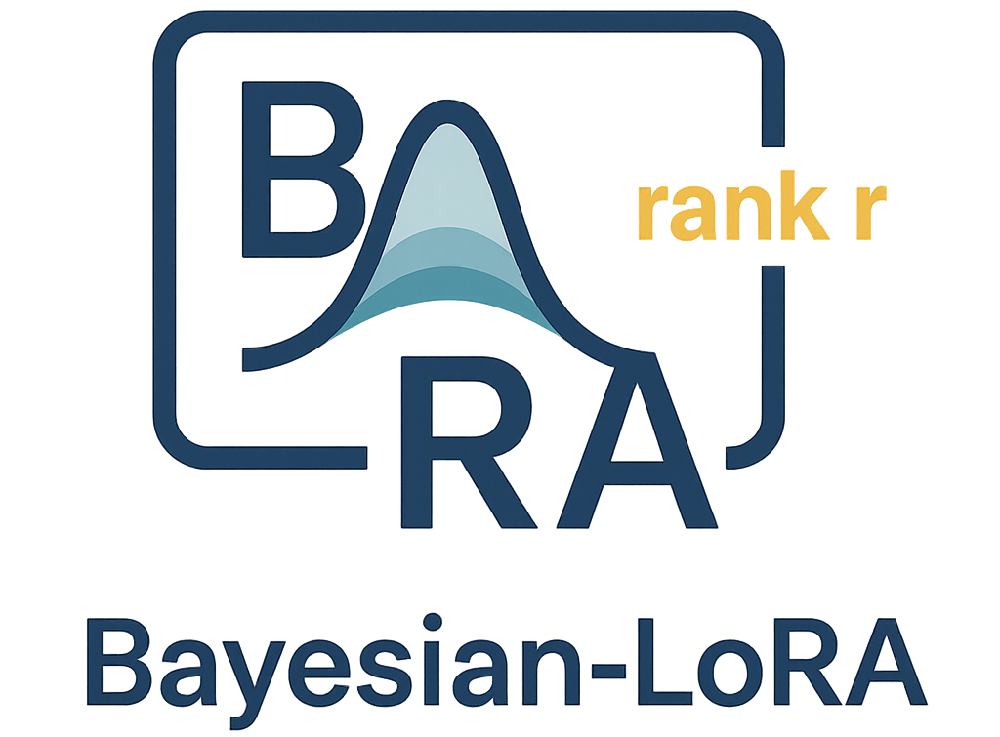

# Bayesian-LoRA: Probabilistic Low-Rank Adaptation for LLMs

<p align="center">

</p>

---
## Overview

This repository contains the **official and anonymous implementation** of the paper:

**Bayesian-LoRA: Probabilistic Low-Rank Adaptation for Large Language Models**  
*(Under review at ICML 2026)*

Bayesian-LoRA introduces a **Bayesian treatment of low-rank adaptation** by placing probabilistic priors over LoRA factors and performing variational inference via sparse inducing variables. 


#### Repository Structure

```

.
├── bnn/             # Probabilistic framework for LLMs
├── logs/            # files of logs
├── utils/           # utils
|── configs/         # Hydra configuration                   
├── train_script.py  # Training entrypoint
└── README.md

```
## Installation

- Python ≥ 3.9  
- PyTorch ≥ 2.0  
- Recommended: `transformers`, `peft`, `numpy`, `scipy`, `tqdm`, `matplotlib`, etc.

```bash
pip install -r requirements.txt
# or install dependencies manually
````

---

## Quick Start (Training)

Run the training script and stream outputs to a log file:

```bash
python ./train_script.py  > ./logs/arc_c.log 2>&1
```

* Configure dataset paths, LoRA ranks, SGP inducing sizes, and evaluation cadence under folder of `configs` (or your config).
* Metrics (e.g., ACC/ECE/NLL) will be printed to stdout and captured in the log.

---

## Implementation Details

> Graphical model of the sparse inducing weight framework. 
Inducing variables $U$ generate the effective **weights A and B through a conditional Gaussian** distribution **$p(W_A\mid U)$ and $p(W_B\mid U)$**. 
Given the weights, each data point is generated via $y_n \sim p(y_n \mid f(x_n; W))$. 
This formulation replaces the low-rank adaptation in LoRA by a Bayesian treatment of low-dimensional inducing weights.


---

## Bayesian Optimization (Winograd\_M)

We used Bayesian Optimization to search hyperparameters and summarize trade-offs (e.g., **ACC↑**, **ECE↓**, **NLL↓**) on **Winograd\_M**. The following figures visualize the Pareto front:

* **ACC vs. (ECE & NLL):**


**Reading the plots**

* Each point corresponds to a hyperparameter configuration (e.g., learning rate, weight decay).
* Pareto-front points are non-dominated: improving one objective worsens at least one other.
* Select operating points on/near the front based on calibration vs. accuracy needs.

---

## Implementation Notes

* Core SGP components live in `bnn/` (inducing variables, variational inference, whitening, etc.).
* Typical inference overhead is modest; a small number of stochastic samples often suffices.
* Logs under `./logs/` can be grepped for metrics and debugging.

---

## One example more on the ARC_Easy Dataset

1. Ensure the ARC_Easy data path is set.
2. Run:

   ```bash
   python ./train_script.py  > ./logs/arc_e.log 2>&1
   ```
3. Inspect `./logs/arc_c.log` for metrics and checkpoints.

---

## License

MIT License

---

## Acknowledgements

Thanks to the open-source community for LoRA/PEFT that enabled this work.


```
