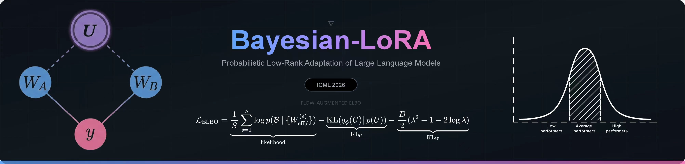
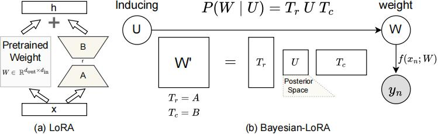
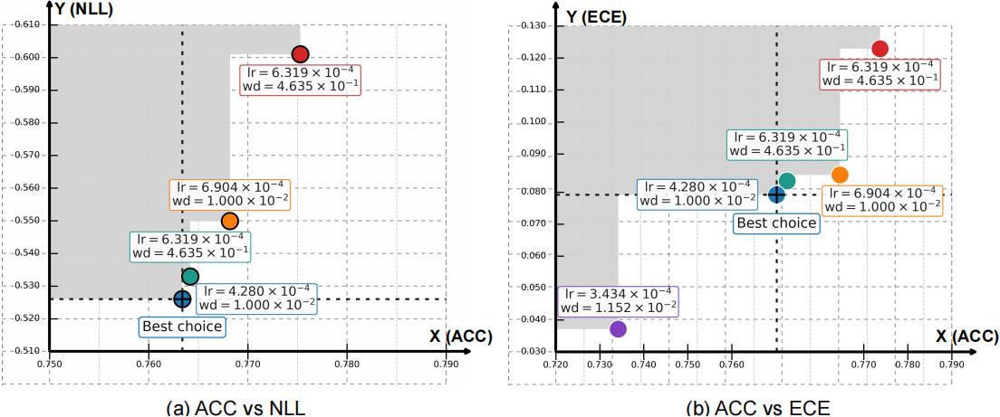

<p align="center">
  
</p>

<p align="center">
  <a href=""></a>
  <a href="#license"></a>
  
  
  
  
</p>

<p align="center">
  <a href="https://github.com/anonymous/bayesian-lora/stargazers"></a>
  <a href="https://github.com/anonymous/bayesian-lora/network/members"></a>
  <a href="https://github.com/anonymous/bayesian-lora/issues"></a>
</p>

<p align="center">
  <b>Official implementation</b> of <i>"Bayesian-LoRA: Probabilistic Low-Rank Adaptation of Large Language Models"</i>
  <br/>
  <sub>Anonymous Authors &mdash; Under review at <b>ICML 2026</b></sub>
</p>

---

<details>
<summary><b>Table of Contents</b></summary>

- [Abstract](#abstract)
- [Highlights](#highlights)
- [Method Overview](#1-method-overview)
  - [Motivation](#11-motivation)
  - [Graphical Model](#12-graphical-model)
  - [Variational Inference](#13-variational-inference)
  - [Posterior Approximations](#14-posterior-approximations)
  - [Efficient Conditional Sampling](#15-efficient-conditional-sampling-matherons-rule)
- [Repository Structure](#2-repository-structure)
- [Installation](#3-installation)
- [Usage](#4-usage)
- [Configuration](#5-key-configuration-parameters)
- [Experimental Results](#6-experimental-results)
- [Implementation Highlights](#7-implementation-highlights)
- [Citation](#citation)
- [License](#license)
- [Acknowledgements](#acknowledgements)

</details>

---

## Abstract

We propose **Bayesian-LoRA**, a principled Bayesian framework for low-rank adaptation (LoRA) of large language models. By introducing **sparse inducing variables** over the LoRA weight factors, we perform scalable variational inference that yields calibrated predictive uncertainty without sacrificing task accuracy. Our approach places a matrix-normal prior over the inducing weights $U$ and derives the conditional distribution $p(W \mid U)$ in closed form, enabling efficient posterior sampling via **Matheron's rule** with Kronecker-factored covariance. We demonstrate consistent improvements in calibration (ECE) and predictive likelihood (NLL) across multiple reasoning benchmarks, while maintaining competitive accuracy with standard LoRA fine-tuning.

---

## Highlights

<table>
<tr>
<td width="50%">

**Principled Uncertainty**
- Bayesian treatment of LoRA via sparse inducing variables
- Calibrated predictive distributions with Monte Carlo sampling
- Closed-form conditional KL divergence

</td>
<td width="50%">

**Scalable & Modular**
- Drop-in replacement for standard LoRA layers
- Compatible with 4-bit / 8-bit quantization
- Minimal overhead via Matheron's rule sampling

</td>
</tr>
<tr>
<td>

**Flexible Posteriors**
- Diagonal, Matrix Normal, Full, and Ensemble variational families
- Optional normalizing flows for richer approximations
- Learnable conditional noise scaling

</td>
<td>

**Strong Empirical Results**
- ACC: 0.72 -- 0.79 across configurations
- ECE: as low as 0.03 (well-calibrated)
- NLL: 0.52 -- 0.60 (improved likelihood)

</td>
</tr>
</table>

---

## 1. Method Overview

### 1.1 Motivation

Standard LoRA decomposes weight updates as $\Delta W = BA$, where $B \in \mathbb{R}^{d_{\text{out}} \times r}$ and $A \in \mathbb{R}^{r \times d_{\text{in}}}$. This point-estimate approach discards epistemic uncertainty, leading to overconfident predictions and poor calibration on out-of-distribution data.

Bayesian-LoRA addresses this by introducing a **sparse Gaussian process (SGP) framework** over the LoRA factors, enabling tractable Bayesian inference at scale.

### 1.2 Graphical Model

> Inducing variables $U$ generate the effective weights $W_A$ and $W_B$ through a conditional Gaussian distribution $p(W_A \mid U)$ and $p(W_B \mid U)$. Given the weights, each observation is generated via $y_n \sim p(y_n \mid f(x_n; W))$. This formulation replaces the deterministic low-rank decomposition in LoRA with a Bayesian treatment over low-dimensional inducing weights.

<p align="center">

</p>

### 1.3 Variational Inference

We maximize the evidence lower bound (ELBO):

$$\mathcal{L}(\theta) = \underbrace{\mathbb{E}_{q(W)}[\log p(\mathcal{D} \mid W)]}_{\text{Expected log-likelihood}} - \beta \cdot \underbrace{\mathrm{KL}\big[q(U) \,\|\, p(U)\big]}_{\text{Inducing prior regularization}} - \underbrace{\mathbb{E}_{q(U)}\big[\mathrm{KL}[q(W \mid U) \,\|\, p(W \mid U)]\big]}_{\text{Conditional regularization}}$$

where $\beta$ is an adaptive KL scaling factor. The conditional KL admits a closed-form solution:

$$\mathrm{KL}[q(W \mid U) \| p(W \mid U)] = d_{\text{in}} \cdot d_{\text{out}} \cdot \left(\tfrac{1}{2}\lambda^2 - \log \lambda - \tfrac{1}{2}\right)$$

### 1.4 Posterior Approximations

The framework supports multiple variational families for $q(U)$:

| Posterior Form | Description | Complexity |
|:---|:---|:---|
| **Diagonal** | $q(U) = \mathcal{N}(\mu, \mathrm{diag}(\sigma^2))$ with optional normalizing flow | $\mathcal{O}(m)$ |
| **Matrix Normal** | $q(U) \sim \mathcal{MN}(\mu, \Sigma_r, \Sigma_c)$ with Kronecker-factored covariance | $\mathcal{O}(m_r^2 + m_c^2)$ |
| **Full** | $q(\mathrm{vec}(U)) \sim \mathcal{N}(\mu, \Sigma)$ with dense covariance | $\mathcal{O}(m^2)$ |
| **Ensemble** | Discrete mixture of $K$ point masses | $\mathcal{O}(Km)$ |

### 1.5 Efficient Conditional Sampling (Matheron's Rule)

Weight samples $W \mid U$ are drawn via:

$$W \mid U = T_r \, U \, T_c + \varepsilon$$

where $T_r, T_c$ are deterministic transforms derived from spectral-normalized bases $Z_r, Z_c$ and diagonal noise parameters $D_r, D_c$:

$$T_r = Z_r^\top (Z_r Z_r^\top + D_r^2)^{-1}, \quad T_c = (Z_c Z_c^\top + D_c^2)^{-1} Z_c$$

This avoids explicit construction of the full covariance matrix, enabling $\mathcal{O}(m^2 d)$ sampling cost.

---

## 2. Repository Structure

```
.
├── bnn/                          # Bayesian neural network framework
│   ├── nn/
│   │   ├── mixins/variational/   # Variational inference mixins (SGP, inducing layers)
│   │   └── modules.py            # InducingLinear, InducingConv{1,2,3}d
│   ├── distributions/
│   │   ├── matrix_normal.py      # MatrixNormal with Kronecker-factored covariance
│   │   └── kl.py                 # Registered KL divergence implementations
│   ├── bayesianize_.py           # In-place Bayesianization of LoRA layers
│   └── calibration.py            # ECE, calibration curves
├── configs/                      # Hydra configuration (modular YAML)
│   ├── inducing/                 # Inducing variable hyperparameters
│   ├── llm/                      # Model and PEFT/LoRA settings
│   ├── dset/                     # Dataset configurations
│   └── opt/                      # Optimizer and scheduler settings
├── utils/                        # Utilities (parameter counting, logging)
├── train_script.py               # Training and evaluation entrypoint
└── requirements.txt
```

---

## 3. Installation

**Prerequisites:** Python >= 3.9, PyTorch >= 2.0, CUDA 11.8+

```bash
# Clone the repository
git clone https://github.com/anonymous/bayesian-lora.git
cd bayesian-lora

# Install dependencies
pip install -r requirements.txt
```

<details>
<summary>Key dependencies</summary>

| Package | Version | Purpose |
|:---|:---|:---|
| `torch` | >= 2.0 | Deep learning framework |
| `transformers` | >= 4.41 | Pretrained LLMs |
| `peft` | >= 0.11 | LoRA adapter layers |
| `bitsandbytes` | >= 0.43 | 4/8-bit quantization |
| `hydra-core` | >= 1.3 | Configuration management |
| `nflows` | >= 0.14 | Normalizing flows |
| `scipy` | >= 1.11 | Scientific computing |

</details>

---

## 4. Usage

### Training

```bash
python ./train_script.py > ./logs/arc_c.log 2>&1
```

All hyperparameters are managed via [Hydra](https://hydra.cc/) and can be overridden from the command line:

```bash
python ./train_script.py \
    llm.peft.r=16 \
    inducing.inducing_rows=12 \
    inducing.inducing_cols=12 \
    inducing.q_inducing=diagonal \
    opt.lr=5e-4
```

### Monte Carlo Inference

During inference, we draw $S$ stochastic weight samples and average the predictive distribution:

$$p(y \mid x, \mathcal{D}) \approx \frac{1}{S} \sum_{s=1}^{S} p(y \mid x, W^{(s)}), \quad W^{(s)} \sim q(W)$$

This is handled automatically by `mc_predict_proba()` in [`train_script.py`](train_script.py). Metrics reported: **ACC**, **NLL**, **ECE**.

---

## 5. Key Configuration Parameters

> All configs are in [`configs/`](configs/) and composed via Hydra.

| Parameter | Description | Default |
|:---|:---|:---|
| `inducing_rows` / `inducing_cols` | Dimensions of inducing matrix $U \in \mathbb{R}^{m_r \times m_c}$ | 9 |
| `q_inducing` | Variational posterior family (`diagonal`, `matrix`, `full`, `ensemble`) | `diagonal` |
| `whitened_u` | Use whitened parameterization $p(U) = \mathcal{N}(0, I)$ | `true` |
| `learn_lamda` | Learn conditional noise scaling $\lambda$ | `true` |
| `init_lamda` / `max_lamda` | Initial and maximum value of $\lambda$ | 0.001 / 0.03 |
| `prior_sd` | Prior standard deviation on inducing weights | 0.1 |
| `key_layers` | Target modules for Bayesianization | `[q_proj, k_proj, lm_head]` |
| `cache_cholesky` | Cache Cholesky decompositions across forward passes | `true` |

---

## 6. Experimental Results

### Pareto Analysis on Winograd_M

We employ Bayesian optimization to jointly optimize the trade-off between accuracy, calibration error, and predictive likelihood. The Pareto front reveals the non-dominated configurations:

<p align="center">

<br/>
<sub><b>Figure:</b> Pareto front over hyperparameter configurations on Winograd_M. Each point represents a configuration <i>(lr, wd, m<sub>r</sub>, m<sub>c</sub>, &lambda;<sub>max</sub>, &sigma;<sub>prior</sub>)</i>.</sub>
</p>

### Performance Summary

| Metric | Range | Optimum |
|:---|:---:|:---:|
| **Accuracy** (ACC) | 0.72 -- 0.79 | $\uparrow$ |
| **Expected Calibration Error** (ECE) | 0.03 -- 0.13 | $\downarrow$ |
| **Negative Log-Likelihood** (NLL) | 0.52 -- 0.60 | $\downarrow$ |

---

## 7. Implementation Highlights

| Feature | Description |
|:---|:---|
| **Matheron's Rule** | Efficient conditional sampling without materializing full covariance matrices |
| **Kronecker-Factored MatrixNormal** | Scalable KL divergence and sampling via row/column factorization |
| **Normalizing Flows** | Optional `MaskedAffineAutoregressiveTransform` for richer posterior expressiveness |
| **Spectral Normalization** | Applied to all learnable bases $Z_r, Z_c$ and flow parameters for stability |
| **Mixed-Precision** | FP32 I/O forcing ensures numerical stability under 4-bit/8-bit quantization |
| **Modular Bayesianization** | [`bayesianize_()`](bnn/bayesianize_.py) performs in-place replacement of LoRA layers with probabilistic counterparts |

---

## Citation

If you find this work useful, please consider citing:

```bibtex
@inproceedings{anonymous2026bayesianlora,
  title     = {Bayesian-LoRA: Probabilistic Low-Rank Adaptation of Large Language Models},
  author    = {Anonymous},
  booktitle = {Proceedings of the International Conference on Machine Learning (ICML)},
  year      = {2026},
  note      = {Under review}
}
```

---

## License

This project is released under the [MIT License](LICENSE).

## Acknowledgements

We thank the developers of [PEFT](https://github.com/huggingface/peft), [Hugging Face Transformers](https://github.com/huggingface/transformers), and [nflows](https://github.com/bayesiains/nflows) for their open-source contributions.

---

<p align="center">
  <sub>If you find this repository helpful, please consider giving it a star.</sub>
</p>
