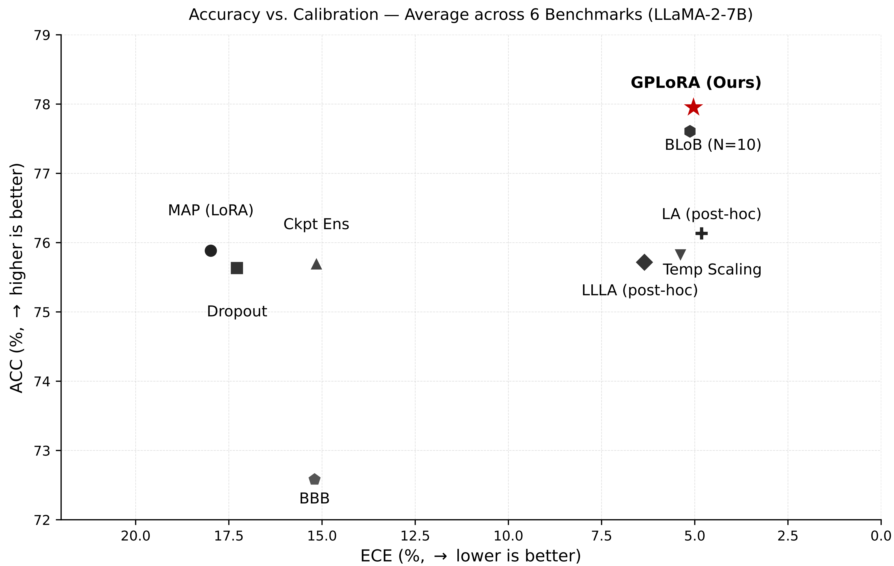
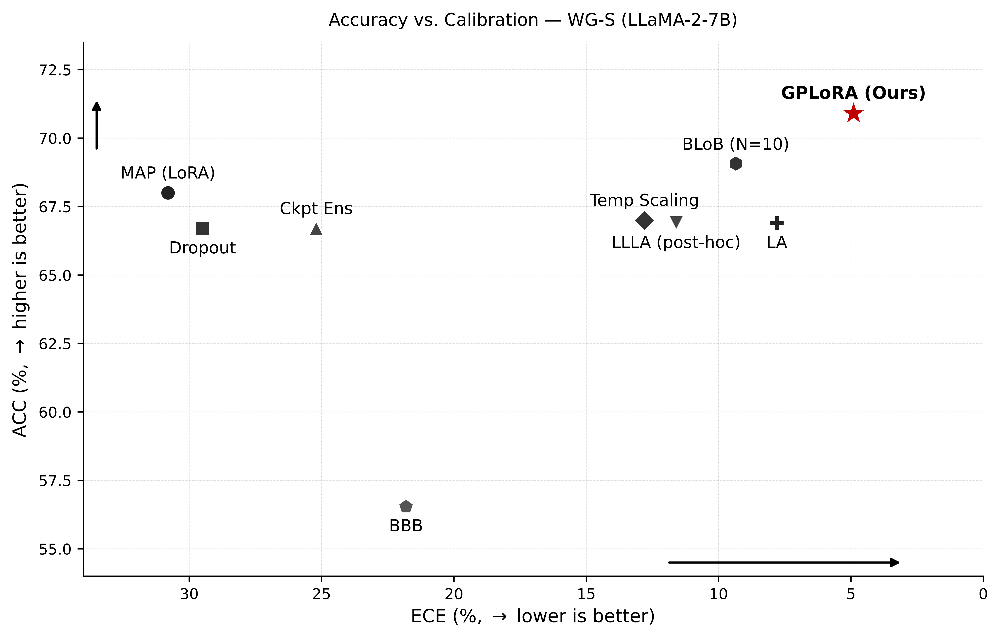

# Rebuttal Figures

## Figure 1: Accuracy vs. Calibration (Average across 6 Benchmarks)

**Caption:** Accuracy (ACC, ↑) vs. Expected Calibration Error (ECE, ↓) for LLaMA-2-7B averaged across 6 benchmarks. Each marker represents a different method. Bayesian RA (Ours, red star) achieves the best joint performance — highest accuracy and lowest ECE — outperforming both training-time Bayesian baselines (BLoB, Dropout, Ckpt Ens, BBB) and post-hoc calibration methods (LA, LLLA, Temp Scaling). The ideal region is the upper-right corner (high ACC, low ECE).

---

## Figure 2: Accuracy vs. Calibration on WG-S

**Caption:** Accuracy (ACC, ↑) vs. Expected Calibration Error (ECE, ↓) for LLaMA-2-7B on the Winogrande (WG-S) benchmark. Bayesian RA (Ours, red star) again occupies the top-right Pareto-optimal corner, achieving the highest accuracy while maintaining competitive calibration. BBB collapses to near-random accuracy, and post-hoc methods (LA, LLLA, Temp Scaling) reduce ECE only at the cost of lower accuracy relative to Bayesian RA.
